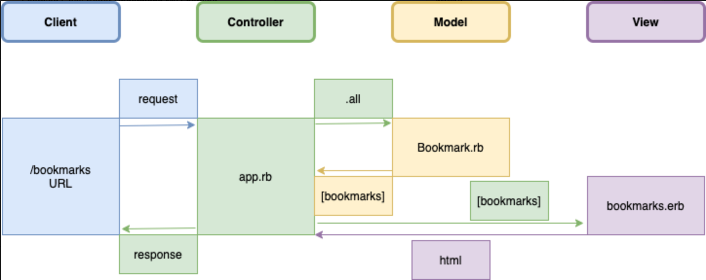

# Bookmark Manager Challenge

This repository provides a Bookmark Manager with the following user stories:

```
As a user
So that I can quickly access my favourite web pages
I would like to be able to view my bookmark list.
```

```
As a user
So I can store bookmarks for later retrieval
I want to add a bookmark to Bookmark Manager.
```

## Domain Model



## How to use
### To set up the project
Clone this repository and then run:
```
bundle
```

### To set up the database

Connect to `psql` and create the `bookmark_manager` and `bookmark_manager_test` databases:

```
CREATE DATABASE bookmark_manager;
CREATE DATABASE bookmark_manager_test;
```

To set up the appropriate tables, connect to each database in `psql` and run the SQL scripts in the `db/migrations` folder in the given order.

### To run the Bookmark Manager app:

```
rackup -p 3000
```

To view bookmarks, navigate to `localhost:3000/bookmarks`.

### To run tests:

```
rspec
```
### To run linting:
```
rubocop
```
